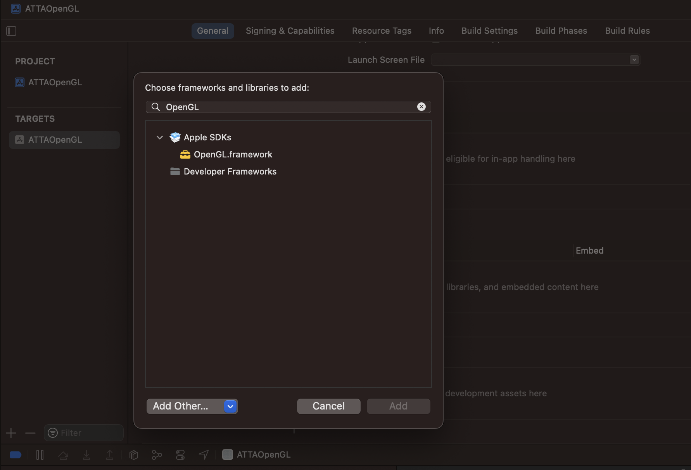
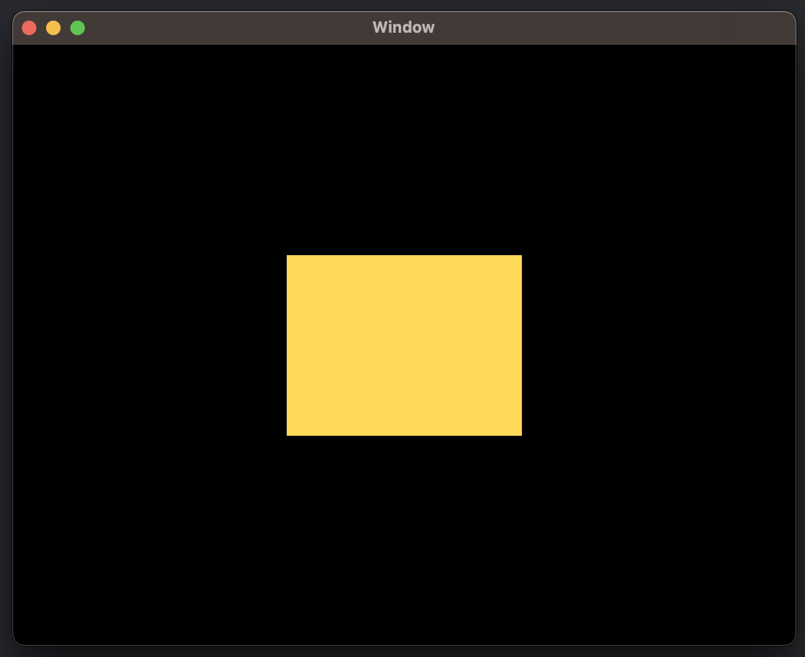
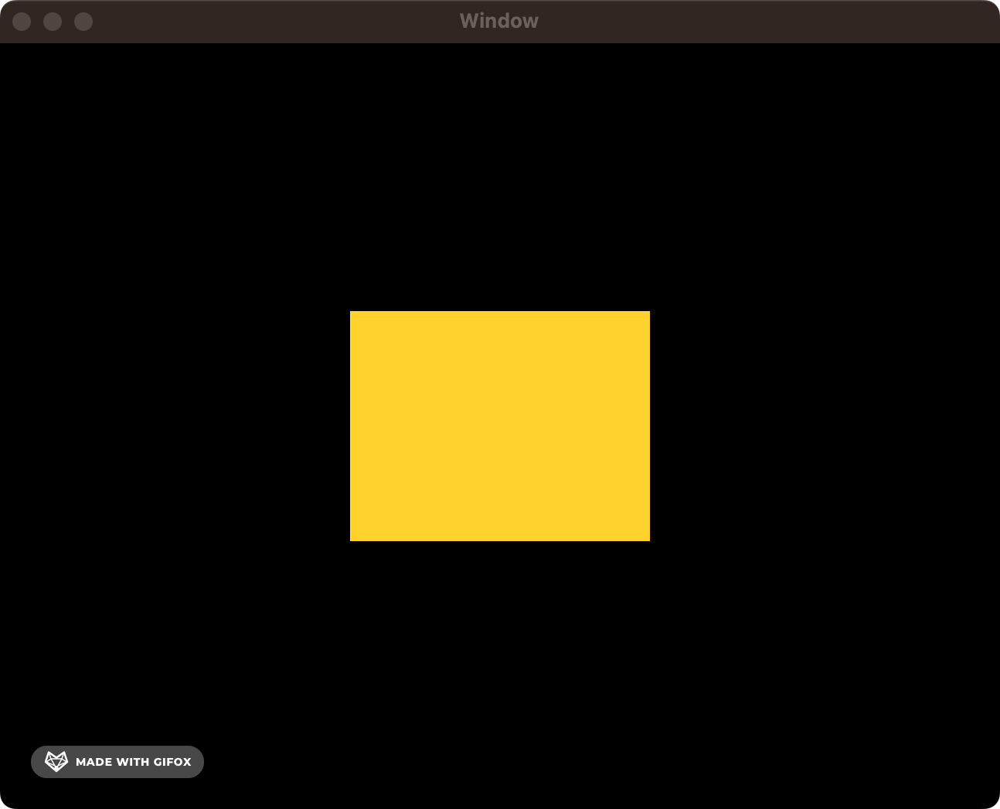

# Through the Ages: Apple Animation APIs

###### From NextStep to Mac OSX to SwiftUI 

---

I recently stumbled upon John Siracusa's legendary Mac OS X reviews for the first time.

If you're not in the loop, these were astonishingly detailed techincal reviews of Apple's major Mac OS X releases between 1999 and 2014. According to [Ars Technica](https://arstechnica.com/gadgets/2015/04/after-fifteen-years-ars-says-goodbye-to-john-siracusas-os-x-reviews/), where these were published, *"a new OS X release started with Steve Jobs and ended with John Siracusa."* I voraciously delved into these reviews with a [handy reading list](https://gist.github.com/kconner/cff08fe3e0bb857ea33b47d965b3e19f) as my tour guide.

What I found most fascinating - and what really inspired me to write this - was the piece on [Core Animation](https://arstechnica.com/gadgets/2007/10/mac-os-x-10-5/8/) from 2007. As a Swift baby, who barely remembers the [Grand Renaming](https://docs.elementscompiler.com/Silver/GrandRename/) of Swift 2.0 --> 3.0, Core Animation is as fundamental as iOS itself, underpinning a huge amount of what makes up UIKit and SwiftUI.

Learning of the existence of a world before Core Animation is like finding out the world isn't really 6000 years old, or discovering that [kaiju roamed the earth millions of years ago](https://www.wikipedia.org/dinosaurs). It's like learning that before we invented fire, we cooked food by re-arranging the atoms by hand. Which, incidentally, is essentially what these [pre-2007 caveman engineers](https://grugbrain.dev/) had to do when they wanted to wrestle dinosaurs, or resize a window.

In this article, I'm going to take us on a journey through in time to discover what was available to the Apple devs of each era; play with some old-fashioned code; and understand the problems solved by each generation of animation APIs.

---

### Timeline

**1989** - NextStep era: Display PostScript

**2001** - OpenGL & Quartz

**2007** - Core Animation 

**2014** - Metal

**2019** - SwiftUI

---

### 1989 - NextStep era: Display PostScript


### 2001 - OpenGL

Steps to making this mini project 

- Link the OpenGL framework to Xcode
- Draw OpenGL view in NSView 
- Customise it 

Back in the early 2000s, you relied on open-source graphics frameworks like OpenGL when you wanted to draw something to the screen. 

[This 2004 tutorial from Apple](https://developer.apple.com/library/archive/documentation/GraphicsImaging/Conceptual/OpenGL-MacProgGuide/opengl_drawing/opengl_drawing.html) once again shows they used to be untouchable when it comes to documentation.

> I hit an amusing build warning before I even drew anything: 
> 
> `@interface MyOpenGLView : NSOpenGLView`
> 
> *"`NSOpenGLView` is deprecated: first deprecated in macOS 10.14 - Please use `MTKView` instead."*
> 
> OpenGL was deprecated in iOS Mojave, in favor of Metal, which we'll come to later on. 

Add OpenGL to Frameworks, Libraries, and Embedded Content in the General project settings. 



First, we make a simple Obj-C header file, `MyOpenGLView.h`:

```
#import <Cocoa/Cocoa.h>

@interface MyOpenGLView : NSOpenGLView
{
    
}

- (void) drawRect: (NSRect) bounds;

@end
```

And we write our implementation file, file, `MyOpenGLView.m`:

```
#include <OpenGL/gl.h>
#import "MyOpenGLView.h"

@implementation MyOpenGLView

- (void) drawRect : (NSRect) bounds
{
    glClearColor(0, 0, 0, 0);
    glClear(GL_COLOR_BUFFER_BIT);
    drawAnObject();
    glFlush();
}

static void drawAnObject(void)
{
    glColor3f(1.0f, 0.85f, 0.35f);
    glBegin(GL_QUADS);
    {
        glVertex3f( -0.3,  0.3, 0.0);
        glVertex3f(  0.3,  0.3, 0.0);
        glVertex3f(  0.3, -0.3, 0.0);
        glVertex3f( -0.3, -0.3, 0.0);
    }
    glEnd();
}

@end
```

The `drawRect(bounds:)` method sets black as the background color, runs our drawing routine, and then flushes to OpenGL to tell it to draw to the screen.

`drawAnObject()` sets a golden color and draws out the vertices of a square. `glBegin(GL_QUADS)` tells OpenGL that the following vertices should be grouped into fours, and drawn on-screen as squares.

Fnally, to display the view on-screen, I simply set the main View Controller's view as a new instance of `MyOpenGLView` (while `ViewController` as a concept didn't exist until ##XXXX, I'd rather create something you can try out yourself rather than be a purist and shell out for a LISA).

# Citation needed ^

```
@implementation ViewController

- (void)viewDidLoad {
    [super viewDidLoad];

    self.view = [[MyOpenGLView alloc] init];
}
```

And here's the result: A beautiful golden square drawn to the screen.



#### Let's add some animation! 

Coming from the world of Core Animation and SwiftUI, this is a little more literal than you might be used to. We're literally setting up a timer and changing the frame we draw to the screen:

We add some properties to the view.

```
@implementation MyOpenGLView

{
    float size;
    float increment;
    NSTimer *timer;
}
```

We update `drawAnObject()` to use the size property to draw the vertices:

```
static void drawAnObject(float size)
{
    glColor3f(1.0f, 0.85f, 0.35f);
    glBegin(GL_QUADS);
    {
        glVertex3f( -size,  size, 0.0);
        glVertex3f(  size,  size, 0.0);
        glVertex3f(  size, -size, 0.0);
        glVertex3f( -size, -size, 0.0);
    }
    glEnd();
}
```

Finally, we override the `initWithFrame` method of the `OpenGLView` to add a timer with some simple logic to scale the square we draw up and down:

```
- (instancetype) initWithFrame : (NSRect) frame
{
    self = [super initWithFrame:frame];
    if (self) {
        size = 0.3;
        increment = 0.005;
        timer = [NSTimer scheduledTimerWithTimeInterval:1.0/60.0
                                                 target:self
                                               selector:@selector(animate)
                                               userInfo:nil
                                                repeats:YES];
    }
    return self;
}

- (void) animate {
    size += increment;
    if (size >= 0.6) {
        increment = -0.005;
    } else if (size <= 0.3) {
        increment = 0.005;
    }
    [self setNeedsDisplay:YES];
}
```



While this example is pretty straightforward, you can see how things might get complicated when you wanted to, for instance, resize multiple elements at once when shrinking a window. Back in the day, you'd also need to take care to make the animation sync up with your screen refresh rate. 


### 2007 - Core Animation 


### 2014 - Metal


### 2019 - SwiftUI
